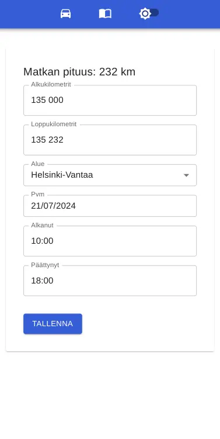
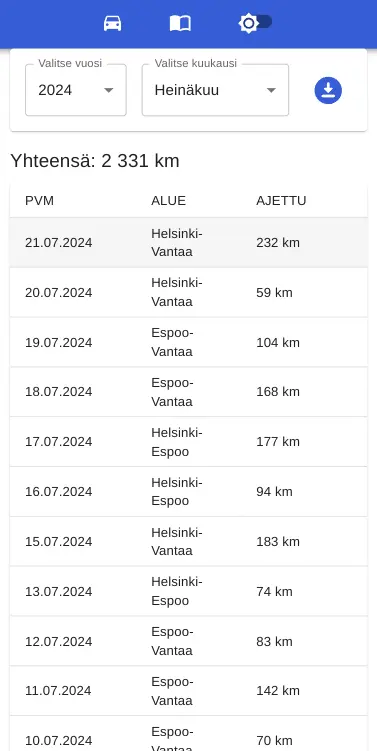
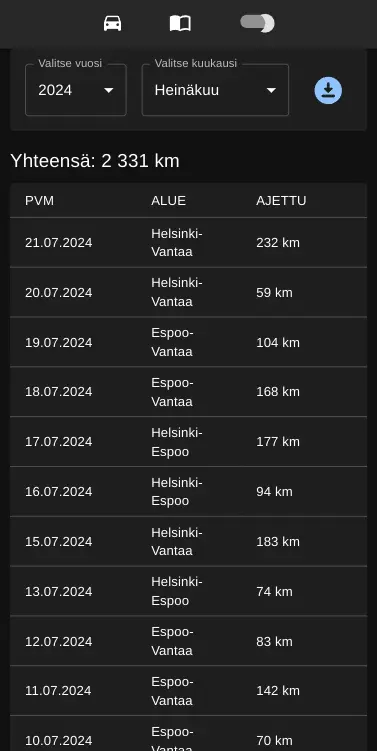
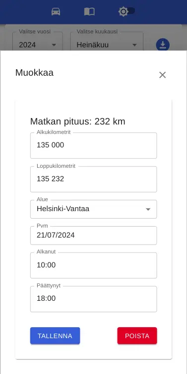
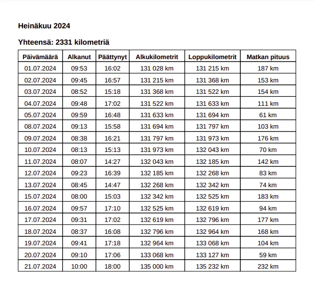

# Car diary

A simple car diary application created for a friend. Feel free to use or modify.

**Note:** The application is in Finnish.

## Overview
- **Frontend:** React (Vite) with Material-UI
- **Backend:** Spring Boot (Kotlin)
- **Database:** PostgreSQL

## Table of Contents
- [Features](#features)
- [Setup Instructions](#setup-instructions)
    - [Backend](#backend)
    - [Frontend](#frontend)
    - [Building the Application](#building-the-application)
    - [Database](#database)
- [Usage](#usage)
- [Screenshots](#screenshots)
- [Deployment](#deployment)
- [License](#license)

## Features
- **Authentication:** Spring Boot Security with basic form login
- **Diary Entries:** Save kilometers to the driving diary
- **PDF Export:** Print required information per month to PDF (generated in the backend using OpenPDF)
- **CRUD Operations:** Create, read, update and delete diary entries
- **Dark Mode:** Application supports dark mode

## Setup Instructions

### Backend
1. Navigate to the `/server` directory:
   ```bash
   cd server
   ```
2. Build the project:
   ```bash
   ./mvnw clean install
   ```
3. Run the application in dev profile:
   ```bash
   ./mvnw spring-boot:run -Dspring-boot.run.profiles=dev
   ```
4. Initialize demo data (optional, but recommended to ensure the local environment has at least one user available for login):
   ```bash
   ./init.sh
   ```

### Frontend
After completing the backend setup, navigate to the frontend directory and start the development server:
1. Navigate to the frontend directory:
   ```bash
   cd frontend
   ```
2. Start the development server:
   ```bash
   npm run dev
   ```

### Building the Application
To build both the frontend and backend as a single `car.jar` file, run the following command:
1. From the root directory of the project:
   ```bash
   ./mvnw clean package
   ```

This will generate a `car.jar` file that can be deployed.

### Database
1. Set up the PostgreSQL database with the required schema.
2. Update the database configuration in `application-dev.properties`.

## Usage
- **Login:** Access the application and login with your credentials.
- **Add Entries:** Save your driving kilometers.
- **Edit Entries:** Modify existing entries.
- **Delete Entries:** Remove unnecessary entries.
- **Export PDF:** Generate a monthly report in PDF format.
- **Dark Mode:** Switch to dark mode as preferred.

## Screenshots
Here are some screenshots of the application:

### Create Entry


### Trips View


### Trips View (Dark Mode)


### Edit Trip


### PDF Export Demo


## Deployment
Using GitHub Actions to deploy this app to Hetzner.

## License
This project is licensed under the MIT License.
